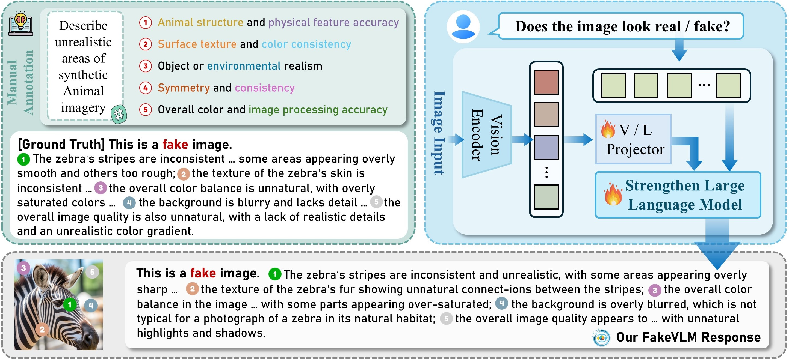
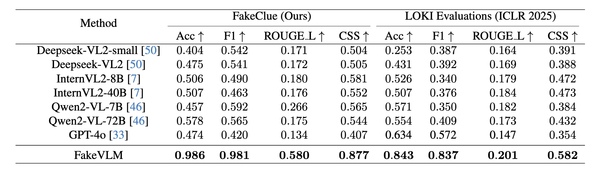
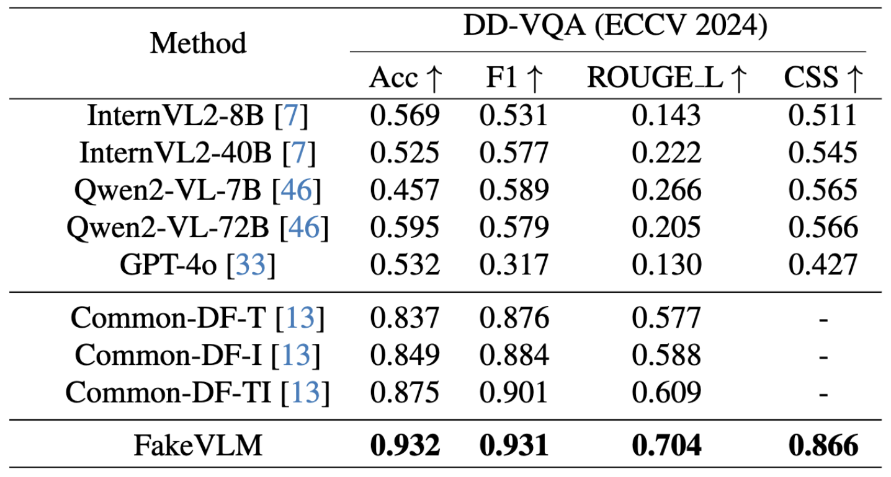
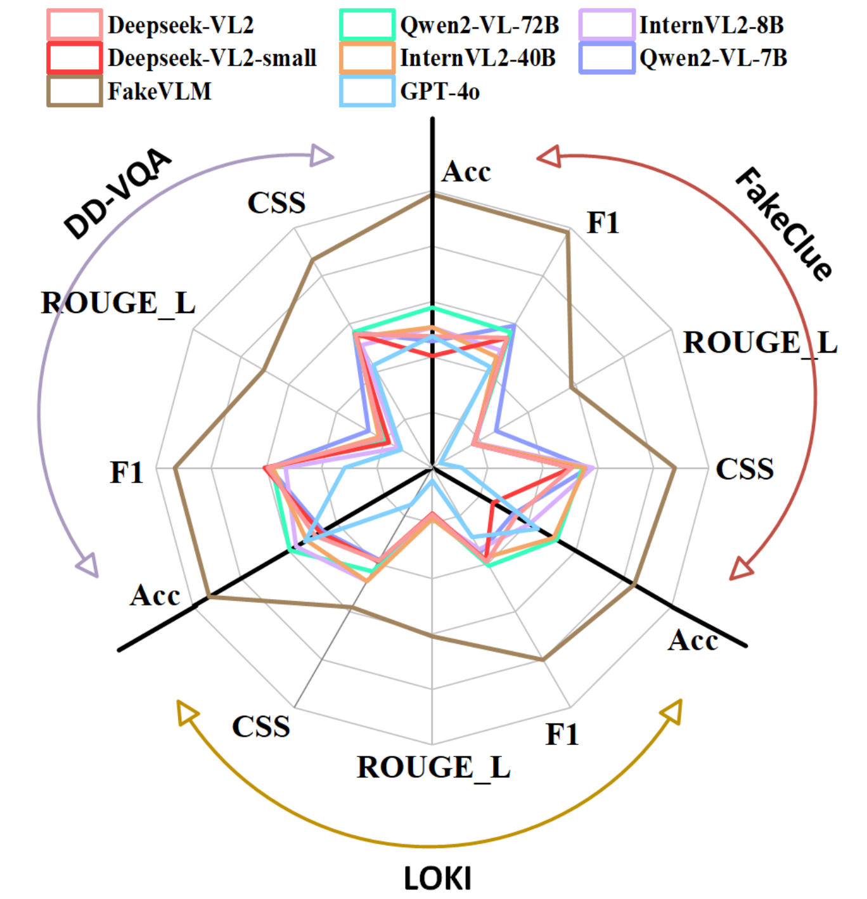

<div align="center">
<h2>  Spot the Fake: Large Multimodal Model-Based Synthetic Image Detection with Artifact Explanation
</h2> 
</div>
<div align="center">

[Siwei Wen](https://scholar.google.com/citations?user=kJRiUYwAAAAJ&hl=zh-CN)<sup>1,3*</sup>, 
[Junyan Ye](https://yejy53.github.io/)<sup>2,1*</sup>,
[Peilin Feng](https://peilin-ff.github.io/)<sup>1,3</sup>, 
[Hengrui Kang](https://scholar.google.com/citations?user=kVbzWCAAAAAJ&hl=zh-CN)<sup>4,1</sup>, <br>
[Zichen Wen](https://scholar.google.com/citations?user=N-aPFvEAAAAJ&hl=zh-CN)<sup>4,1</sup>, 
[Yize Chen](https://openreview.net/profile?id=~Yize_Chen2)<sup>5</sup>, 
[Jiang Wu](https://scholar.google.com/citations?user=LHiiL7AAAAAJ&hl=zh-CN)<sup>1</sup>, 
[Wenjun Wu](https://openreview.net/profile?id=~wenjun_wu3)<sup>3</sup>, 
[Conghui He](https://conghui.github.io/)<sup>1</sup>, 
[Weijia Li](https://liweijia.github.io/)<sup>2,1†</sup>

<sup>1</sup>Shanghai Artificial Intelligence Laboratory, <sup>2</sup>Sun Yat-sen University<br>
<sup>3</sup>Beihang University, <sup>4</sup>Shanghai Jiao Tong University, <sup>5</sup>The Chinese University of Hong Kong, Shenzhen

</div>

<div align="center">

[](https://arxiv.org/pdf/2503.14905) 
[](https://hits.seeyoufarm.com)
[](https://github.com/opendatalab/FakeVLM/issues)
[](https://github.com/opendatalab/FakeVLM/stargazers)
[](https://huggingface.co/datasets/lingcco/FakeClue)

</div>

<!-- <div align="center">
  <p align="center">
    <a href=''>
       </a>
  </p>
</div> -->

## 📰 News
- **[2025.4.15]**: 🤗 We are excited to release the FakeClue dataset. Check out [here](https://huggingface.co/datasets/lingcco/FakeClue).
- **[2025.3.20]**: 🔥 We have released **Spot the Fake: Large Multimodal Model-Based Synthetic Image Detection with Artifact Explanation**. Check out the [paper](https://arxiv.org/abs/2503.14905). We present FakeClue dataset and FakeVLM model.

##  FakeVLM Overview

With the rapid advancement of Artificial Intelligence Generated Content (AIGC) technologies, synthetic images have become increasingly prevalent in everyday life, posing new challenges for authenticity assessment and detection. Despite the effectiveness of existing methods in evaluating image authenticity and locating forgeries, these approaches often lack human interpretability and do not fully address the growing complexity of synthetic data. To tackle these challenges, we introduce FakeVLM, a specialized large multimodal model designed for both general synthetic image and DeepFake detection tasks. FakeVLM not only excels in distinguishing real from fake images but also provides clear, natural language explanations for image artifacts, enhancing interpretability. Additionally, we present FakeClue, a comprehensive dataset containing over 100,000 images across seven categories, annotated with fine-grained artifact clues in natural language. FakeVLM demonstrates performance comparable to expert models while eliminating the need for additional classifiers, making it a robust solution for synthetic data detection. Extensive evaluations across multiple datasets confirm the superiority of FakeVLM in both authenticity classification and artifact explanation tasks, setting a new benchmark for synthetic image detection. 

<div align="center">

</div>

##  Contributions

- We propose FakeVLM,  a multimodal large model designed for both general synthetic and deepfake image detection tasks. It excels at distinguishing real from fake images while also providing excellent interpretability for artifact details in synthetic images.
- We introduce the FakeClue dataset, which includes a rich variety of image categories and fine-grained artifact annotations in natural language.
- Our method has been extensively evaluated on multiple datasets, achieving outstanding performance in both synthetic detection and abnormal artifact explanation tasks.

## 🛠️ Installation
Please clone our repository and change to that folder
```bash
git clone git@github.com:opendatalab/FakeVLM.git
cd FakeVLM
```

Our model is based on the llava environment. Please follow the steps below to configure the environment.
```bash
conda create -n fakevlm python=3.9 -y
conda activate fakevlm
pip install --upgrade pip  
pip install -e .
pip install -e ".[train]"
pip install flash-attn --no-build-isolation
```

## 📦 Dataset
The directory containing the images should have the following structure:

```
playground       
└──data
    └──train
        |--doc
            |--fake
            |--real
        .
        .
        |--satellite
    └──test
        .
        .
        .    
```


## 📌 Usage

## 📊 Results
Performance of 7 leading LMMs and FakeVLM on DD-VQA, Fake Clues and Loki.

- **FakeClue**  
  Ours dataset.
- **LOKI**  
  A new benchmark for evaluating multimodal models in synthetic detection tasks. It includes **human-annotated fine-grained image artifacts**, enabling deeper analysis of artifact explanations. We used its image modality, covering categories like Animals, Humans, Scenery, and Documents.



- **DD-VQA**  
  A dataset for explaining facial artifacts, using **manual annotations** in a VQA format. Artifacts include blurred hairlines, mismatched eyebrows, rigid pupils, and unnatural shadows. It builds on FF++ data and emphasizes common-sense reasoning.

<div align="center">

</div>

To provide a comprehensive comparison of the model performance across the three datasets—FakeClue, LOKI, and DD-VQA—we present the following radar chart. This chart visually highlights the strengths and weaknesses of the 7 leading LMMs and FakeVLM, offering a clear depiction of their results in synthetic detection and artifact explanation tasks.

<div align="center">

</div>

## 😄 Acknowledgement

This repository is built upon the work of [LLaVA](https://github.com/haotian-liu/LLaVA/tree/main). We appreciate their contributions and insights that have provided a strong foundation for our research.

## 📨 Contact

If you have any questions or suggestions, please feel free to contact us 
at [466439420gh@gmail.com](466439420gh@gmail.com).

## 📝 Citation
If you find our work interesting and helpful, please consider giving our repo a star. Additionally, if you would like to cite our work, please use the following format:
```shell
@misc{wen2025spotfakelargemultimodal,
      title={Spot the Fake: Large Multimodal Model-Based Synthetic Image Detection with Artifact Explanation}, 
      author={Siwei Wen and Junyan Ye and Peilin Feng and Hengrui Kang and Zichen Wen and Yize Chen and Jiang Wu and Wenjun Wu and Conghui He and Weijia Li},
      year={2025},
      eprint={2503.14905},
      archivePrefix={arXiv},
      primaryClass={cs.CV},
      url={https://arxiv.org/abs/2503.14905}, 
}
```
